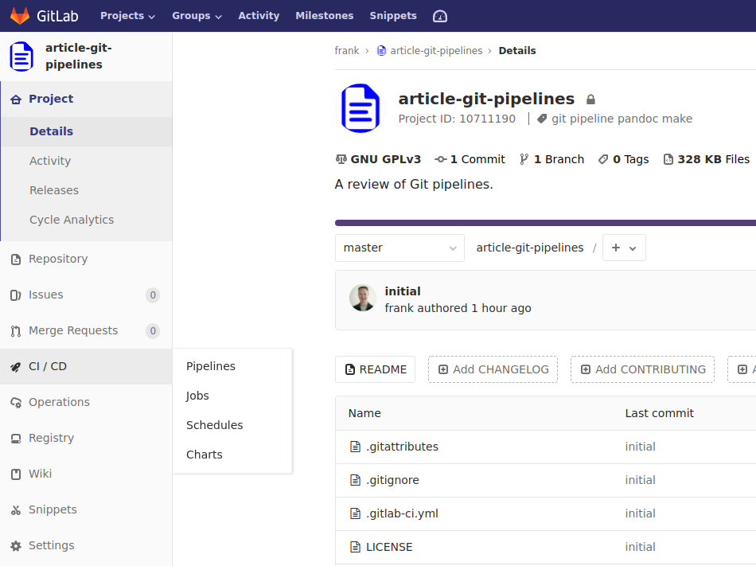
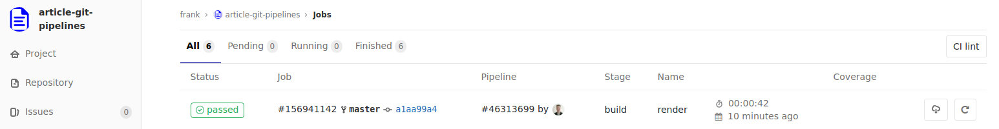
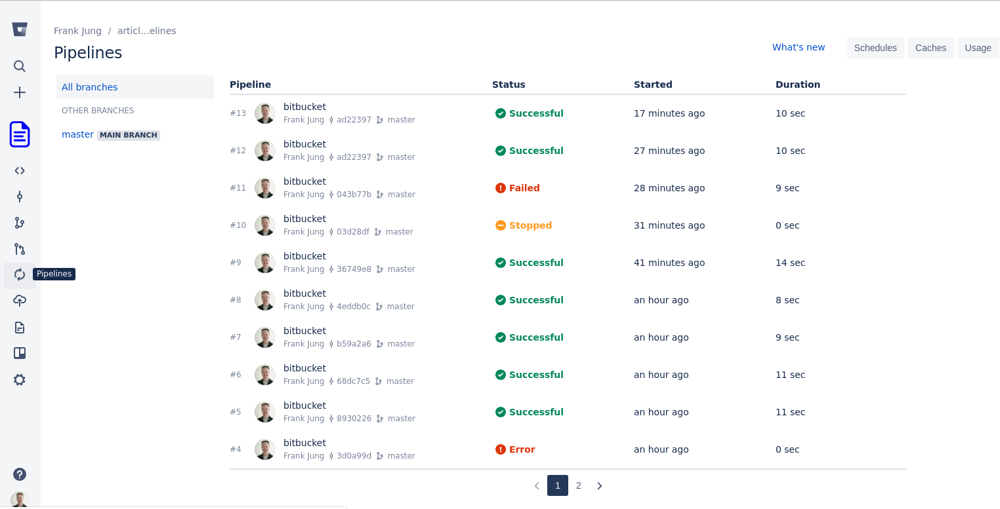
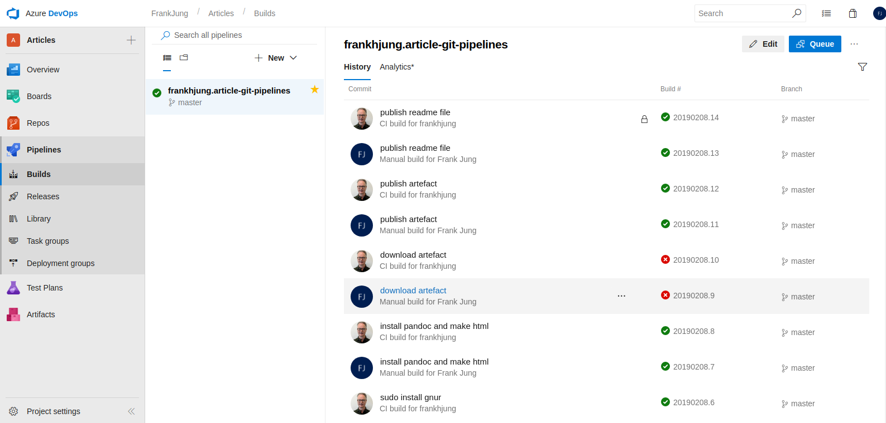
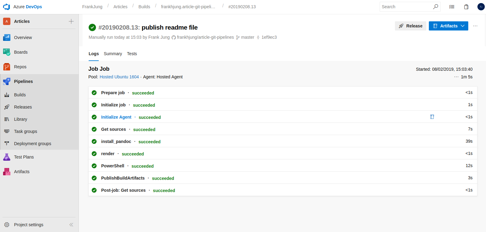
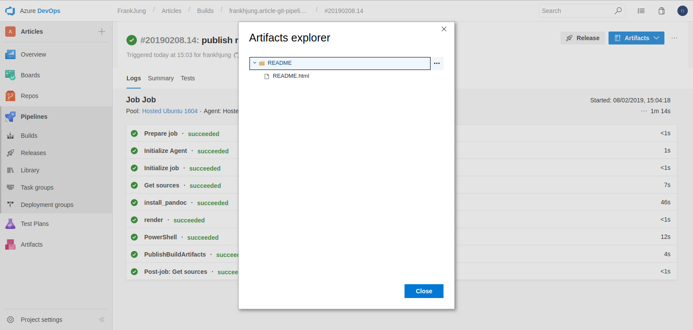

# Introduction

Git has become the _de facto_ standard for version control. This has given
rise to many vendors hosting Git repositories. Each vendor provides Git
functionality such as branching, pull requests, project membership. There is now
growing competition to provide Continuous Integration / Continuous Delivery
(CI/CD) tools. It has become a very competitive market. One feature that extends
version control beyond just source files, is pipelines. Pipelines are extensible
suite of tools to build, test and deploy source code. Even data hosting sites
like [Kaggle](https://www.kaggle.com/) now support
[pipelines](https://www.kaggle.com/dansbecker/pipelines).

This article provides a brief summary of some pipeline features from three
popular hosted sites, [GitLab](https://gitlab.com/),
[Bitbucket](https://bitbucket.org) and [GitHub](https://github.com/).

This project will be used to show features for each Git repository.

The features being tested are:

* use of Docker images
* customise environment
* stages
* archive of generated artefacts

The workflow is:

1. install [GNU Make](https://www.gnu.org/software/make/)
1. install [pandoc](https://pandoc.org/)
1. render HTML from Markdown
1. archive rendered document

Here are other source repositories that offer pipelines that you may also like
to try:

* [Kaggle](https://www.kaggle.com/)
* [DigitalOcean](https://www.digitalocean.com/)
* [Travis CI](https://travis-ci.org/)

# [GitLab](https://gitlab.com/)

GitLab pipelines are well integrated tool. CI / CD pipelines are easily accessed
from the sidebar:



Viewing jobs gives you a pipeline run history:



The YAML configuration `.gitlab-ci.yml` looks like:

```yaml
image: conoria/alpine-pandoc

variables:
  TARGET: README.html

stages:
  - build

before_script:
  - apk update
  - apk add make

render:
  stage: build
  script:
    - make $TARGET
  artifacts:
    paths:
      - $TARGET
```

Where:

* `image` - specifies a custom Docker image from Docker Hub
* `variables` - define a variable to be used in all jobs
* `stages` - declares the jobs to run
* `before_script` - commands to run before all jobs
* `render` - name of job associated with a stage. Jobs of the same stage are run in parallel
* `stage` - associates a job with a stage
* `script` - commands to run for job
* `artitacts` - path to objects to archive, these can be downloaded if job
  completes successfully

What this pipeline configuration does is:

* load a Alpine Docker image for pandoc
* invoke the build stage which
  * initialises with alpine package update and install
  * runs the `render` job which makes the given target
  * on successful completion, the target HTML is archived for download

GitLab is easy to configure and easy to navigate. There are many other features
including scheduling pipelines, configuring jobs by branch. One feature that I
have used on Maven / Java projects is caching the `.m2` directory. This speeds
up the build as you don't have a completely new environment for each build, but
can rely on previous cached artefacts. GitLab also provides a clear cache button
on the pipeline page.

GitLab also provides additional services that can be integrated with you
project, for example: JIRA tracking, Kubernetes, Prometheus monitoring.


# [Bitbucket](https://bitbucket.org)

The example is publicly available [here](https://gitlab.com/frankhjung1/article-git-pipelines).
The configuration is similar to that from GitLab. The pipeline and settings are
easily navigated to using the side-bar.



The pipeline configuration is similar. But there are important differences.

```yaml
pipelines:
  branches:
    master:
      - step:
          name: render
          image: conoria/alpine-pandoc
          trigger: automatic
          script:
            - apk update && apk add make curl
            - export TARGET=README.html
            - make -B ${TARGET}
            - curl -X POST --user "${BB_AUTH_STRING}" "https://api.bitbucket.org/2.0/repositories/${BITBUCKET_REPO_OWNER}/${BITBUCKET_REPO_SLUG}/downloads" --form files=@"${TARGET}"
```

Here the pipeline will be triggered automatically on commits to `master` branch.
A Docker image can be defined at the level of the pipeline step. Variables can
be defined and read from the Bitbucket settings page. This is useful for
recording secrets that you don't want to have exposed in your source code.
However, internal script variables are set via the script language, which here
is Bash. Finally, in order for the build artefacts to be preserved after the
pipeline completes, you can publish to a downloads location. This requires that
a secure variable be configured, as described
[here](https://confluence.atlassian.com/bitbucket/deploy-build-artifacts-to-bitbucket-downloads-872124574.html).
If you don't the pipeline workspace is purged on completion.


Pipeline build performance is very good, where this entire step took only around
11 seconds to complete.

The free account limits you to 50 minutes per month with 1GB storage.

That you have to externally / manually configure repository settings has some
benefits. The consequence though, is that there are settings that are not
recorded by your project.

A feature of being able to customise the Docker image used at the step level is
that your build and test steps can use different images. This is great if you
want to trial your application on a production like image.


# [GitHub](https://github.com/)

When you create a GitHub repository, there is an option to include [Azure
Pipelines](https://azure.microsoft.com/en-au/services/devops/pipelines/).
However this is not integrated to GitHub directly, but is configured under [Azure
DevOps](https://dev.azure.com/). Broadly, the steps to set-up a pipeline are:

* sign up to Azure pipelines
* create a project
* add GitHub repository to project
* configure pipeline job



Builds can be run and managed from the Azure DevOps dashboard. There appears no
way to manually trigger a build from the GitHub repository. Though, if you
commit it will happily trigger a build for you. But, again, you need to be on
the Azure DevOps dashboard to monitor the pipeline steps.

The following YAML configuration uses an Azure provided Ubuntu 16.04 image.
There are limited images, but they are maintained and kept installed packages
are kept up to date. There are [many pre-installed
packages](https://github.com/Microsoft/azure-pipelines-image-generation/blob/master/images/linux/Ubuntu1604-README.md).

```yaml
trigger:
  - master

pool:
  vmImage: 'Ubuntu-16.04'

steps:

  - script: |
      sudo apt-get install pandoc
    displayName: 'install_pandoc'

  - script: |
      make -B README.html
    displayName: 'render'

  - powershell: gci env:* | sort-object name | Format-Table -AutoSize | Out-File $env:BUILD_ARTIFACTSTAGINGDIRECTORY/environment-variables.txt

  - task: PublishBuildArtifacts@1
    inputs:
      pathtoPublish: '$(System.DefaultWorkingDirectory)/README.html'
      artifactName: README
```

If the package you need is not installed, then you can install it if available
in the Ubuntu package repositories. The default user profile is not `root`, so
installation requires `sudo`.



Finally, to provide the generated artefacts as a downloaded archive you need to
invoke specific `PublishBuildArtifacts` task as described
[here](https://docs.microsoft.com/en-us/azure/devops/pipelines/artifacts/build-artifacts?view=azure-devops&tabs=yaml).



Azure is fast as it uses images that Microsoft built images that they host. The
above job to install `pandoc` and render this page as HTML takes only 1 minute.

I found the biggest negative to Azure Pipelines was the poor integration to the
GitHub dashboard. Instead, you are strongly encouraged to manage pipelines
using the Azure DevOps dashboard.


# Summary

Git pipelines will be not suite in every circumstance. There are however, clear
advantages to using a hosted pipeline that ensures that your project builds
somewhere other than your laptop. It also removes the cost of building and
maintaining your own infrastructure. The pipeline configuration is also augments
your projects documentation for build, test and deployment. It is an independent
executable description for your project that explicitly lists dependencies.
Hosted pipelines also lightens the effort for provisioning and maintaining your
own infrastructure. This could be a great benefit to projects where
time constraints limit ones ability to prepare an environment.


# Acknowledgements

* the CSS stylesheet used here based off [killercup/pandoc.css](https://gist.github.com/killercup/5917178)

